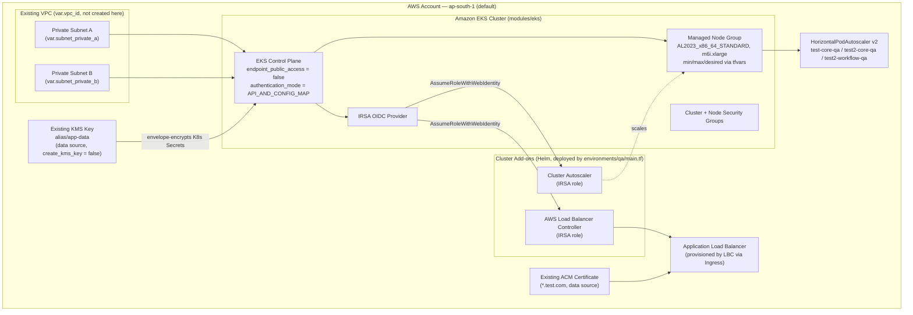

# Terraform — Amazon EKS Platform (QA)


## Executive summary

This repository is a personal Terraform Infrastructure-as-Code project that provisions an **Amazon EKS cluster** (control plane + one managed node group), wires up **cluster autoscaling** and the **AWS Load Balancer Controller** via IAM Roles for Service Accounts (IRSA) and Helm, applies a **Horizontal Pod Autoscaler** for a handful of application deployments, and encrypts Kubernetes Secrets at rest using an existing **AWS KMS** customer-managed key.

Only **one environment exists today — `qa`** (under `environments/qa/`). There is no `dev`, `staging`, or `prod` environment in this repo; any reference to "multi-environment" would overstate the current scope. The `qa` configuration itself contains some clearly unfinished/placeholder resources (see [Status & Roadmap](#status--roadmap) and [Known Issues](#known-issues--recommendations) below) — this reads as an environment that was being actively iterated on rather than a finished, production-hardened deployment.

The reusable building blocks live under `modules/`:

- **`modules/eks`** — a vendored, lightly customized copy of the community [`terraform-aws-modules/terraform-aws-eks`](https://github.com/terraform-aws-modules/terraform-aws-eks) module (cluster, node groups, IRSA, security groups, optional KMS key).
- **`modules/kms`** — a vendored, unmodified copy of the community [`terraform-aws-modules/terraform-aws-kms`](https://github.com/terraform-aws-modules/terraform-aws-kms) module, including its `wrappers/` sub-module pattern for creating multiple keys via `for_each`.

## Architecture



**What actually happens when you `apply` this stack:**

1. `modules/eks` creates the EKS control plane and IAM role, attaches security groups, and creates one managed node group (`node_groups.tf` calls the vendored `./modules/eks-managed-node-group` sub-module).
2. Kubernetes Secrets encryption uses an **existing** KMS key looked up via `data "aws_kms_key" "app-data"` (alias `alias/app-data`) — the module's own optional KMS-key-creation path (`modules/kms`) is **not** used in `qa` (`create_kms_key = false`).
3. `environments/qa/main.tf` then layers on: IAM role + Helm release for the Kubernetes **Cluster Autoscaler**, IAM role + Helm release for the **AWS Load Balancer Controller** (policy pulled live from the upstream GitHub JSON via an `http` data source), an `IngressClass`/`Ingress` pair, ENI config resources for a secondary VPC CIDR, and a `null_resource`/`local-exec` step to update kubeconfig and install `metrics-server`.
4. `hpa-based-on-app.tf` creates a `HorizontalPodAutoscaler` (CPU + memory, 70% target) for each name in `var.hpa_targets`.

## Repository layout

| Path | Contents |
|---|---|
| `README.md` | This file. |
| `LICENSE` | MIT license. |
| `environments/qa/` | The only deployed environment. Root Terraform configuration that calls `modules/eks`, wires up cluster add-ons, and defines the HPA resources. |
| `modules/eks/` | Vendored/customized EKS module (cluster, node groups, IRSA, security groups). See its own [README](modules/eks/README.md). |
| `modules/eks/modules/eks-managed-node-group/` | Upstream sub-module used by `node_groups.tf` to create the managed node group. |
| `modules/eks/modules/_user_data/` | Upstream sub-module that renders node bootstrap user-data (AL2, AL2023, Bottlerocket, Windows). |
| `modules/eks/modules/capability/` | Upstream sub-module for EKS "capabilities" (e.g. ACK) — not currently invoked by `qa`. |
| `modules/eks/templates/` | Cloud-init/user-data templates consumed by `_user_data`. |
| `modules/kms/` | Vendored KMS module (key, aliases, grants, key policy). See its own [README](modules/kms/README.md). |
| `modules/kms/wrappers/` | Upstream `for_each` wrapper for creating multiple KMS keys from one module call. |

## Module reference

| Module | Purpose | Key inputs | Key outputs |
|---|---|---|---|
| [`modules/eks`](modules/eks/README.md) | Creates the EKS control plane, cluster/node security groups, IRSA OIDC provider, cluster IAM role, and (optionally) a managed node group + KMS key, via nested sub-modules. | `name`, `kubernetes_version`, `vpc_id`, `subnet_ids`, `control_plane_subnet_ids`, `endpoint_public_access`, `encryption_config`, `create_kms_key`, `eks_managed_node_groups`, `enable_irsa` | `cluster_name`, `cluster_endpoint`, `cluster_certificate_authority_data`, `oidc_provider_arn`, `oidc_provider`, `cluster_primary_security_group_id`, `kms_key_arn`, `eks_managed_node_groups` |
| [`modules/kms`](modules/kms/README.md) | Creates a KMS key (standard, external, or replica), aliases, grants, and a default or custom key policy. Used internally by `modules/eks` when `create_kms_key = true`; **not** invoked directly by `qa`. | `description`, `key_usage`, `deletion_window_in_days`, `enable_key_rotation`, `key_administrators`, `key_users`, `aliases` | `key_arn`, `key_id`, `key_policy`, `aliases`, `grants` |

## Environments

### `qa` (the only environment)

`environments/qa/` is a standalone root module (its own state, providers, and backend) that:

- Calls `modules/eks` with a **single** managed node group named after `var.name`, AMI type `AL2023_x86_64_STANDARD`, instance type(s) from `var.instance_type` (default `["m6i.xlarge"]`), a 50 GiB `gp3` root volume, and `enable_monitoring = true`.
- Disables the public EKS API endpoint (`endpoint_public_access = false`) — the cluster is reachable only from inside the VPC (or via VPN/bastion/peering), which is a good default.
- Enables IRSA and grants the Terraform-invoking identity cluster-admin via an access entry (`enable_cluster_creator_admin_permissions = true`).
- Encrypts Kubernetes Secrets using an **existing** KMS key (`alias/app-data`) rather than creating a new one.
- Deploys the Cluster Autoscaler and AWS Load Balancer Controller via `helm_release`, each with its own IRSA role.
- Defines `HorizontalPodAutoscaler` objects (`hpa-based-on-app.tf`) for three application deployments (`test-core-qa`, `test2-core-qa`, `test2-workflow-qa` by default).
- Associates a secondary CIDR with existing subnets via `ENIConfig` custom-networking resources (no new subnets/CIDR blocks are created — that block is commented out in `main.tf`).

There is no `dev`, `staging`, or `prod` folder. If you intend to reuse this for another environment, copy `environments/qa/` to a new directory, give it its own backend key/state, and adjust `terraform.tfvars`.

## Prerequisites

| Requirement | Version / detail | Source |
|---|---|---|
| Terraform CLI | `>= 1.5.7` (enforced by both modules; **not currently pinned** in `environments/qa`, see [Known Issues](#known-issues--recommendations)) | `modules/eks/versions.tf`, `modules/kms/versions.tf` |
| AWS provider | `= 6.30.0` (exact pin) in `qa`; modules require `>= 6.0`–`>= 6.28` | `environments/qa/version.tf` |
| Kubernetes provider | `~> 2.19.0` | `environments/qa/version.tf` |
| Helm provider | `~> 2.5` | `environments/qa/version.tf` |
| HTTP provider | `~> 2.1` | `environments/qa/version.tf` |
| AWS credentials | An identity with permissions to manage EKS, IAM, KMS (read), EC2, and CloudWatch Logs; `kubectl`/`helm` access is exercised indirectly through the Kubernetes/Helm Terraform providers and two `local-exec` provisioners. | — |
| Pre-existing AWS resources | A VPC and two private subnets (`vpc_id`, `subnet_private_a`, `subnet_private_b`), a KMS key aliased `alias/app-data`, an ACM certificate for `*.test.com`, and a VPC tagged `Name=vpc-test-79`. **None of these are created by this repo** — they must already exist in the target account. | `environments/qa/main.tf` |
| Local tooling | `aws` CLI and `kubectl` on the machine running `terraform apply` (used by `local-exec` provisioners for kubeconfig setup, metrics-server install, and CNI custom-networking env vars). | `environments/qa/main.tf` |

## Quick start

```bash
cd environments/qa

# 1. Populate terraform.tfvars with real values (see Security considerations below —
#    the checked-in file ships with empty placeholder values, not real ones).

# 2. Initialize providers and the backend
terraform init

# 3. Review the plan
terraform plan

# 4. Apply
terraform apply

# 5. (Optional) point kubectl at the new cluster manually if the local-exec
#    provisioner didn't run in your environment
aws eks update-kubeconfig --name <cluster_name> --region <region>
```

There is no `terraform.tfvars.example` file yet — the tracked `terraform.tfvars` currently serves that purpose (all values are blank strings). See [Known Issues](#known-issues--recommendations).

## State management

`environments/qa/backend.tf` currently configures a **local backend**:

```hcl
terraform {
  backend "local" {
    path = "terraform.tfstate"
  }
}
```

State is written to a local `terraform.tfstate` file next to the configuration. This means:

- **No locking** — two people (or two CI runs) applying at the same time can corrupt state.
- **No shared state** — every operator needs their own copy of the state file, or must pass it around manually.
- **State (including secrets and resource IDs) lives on disk** unless the file is deliberately protected/excluded from version control (see `.gitignore`).

An S3 + DynamoDB remote backend block is already sketched out in `backend.tf` but commented out:

```hcl
# backend "s3" {
#   bucket         = ""
#   key            = ""
#   region         = "ap-south-1"
#   dynamodb_table = "terraform-state-locks"
#   encrypt        = true
# }
```

**Recommendation:** before using this repo for anything beyond solo experimentation, fill in and enable the S3 backend block (with a DynamoDB table for locking, and `encrypt = true`, ideally backed by a KMS key), then run `terraform init -migrate-state`.

## Security considerations

- **Secrets encryption:** Kubernetes Secrets are encrypted at rest using an existing KMS CMK (`alias/app-data`) via the cluster's native `encryption_config` — this is the current AWS-recommended approach for EKS secrets envelope encryption.
- **Private API endpoint:** `endpoint_public_access = false` keeps the Kubernetes API reachable only from inside the VPC — a solid default that should be preserved for any real environment.
- **IRSA over static credentials:** the Cluster Autoscaler and AWS Load Balancer Controller both authenticate via IAM Roles for Service Accounts (OIDC federation) rather than long-lived node/instance credentials — this is best practice.
- **Cluster Autoscaler IAM policy uses `Resource = "*"`** for `autoscaling:*` actions (`environments/qa/main.tf`). AWS's own reference policy for the Cluster Autoscaler scopes this down using `aws:ResourceTag` conditions on the target Auto Scaling Groups; consider tightening this.
- **`terraform.tfvars` is committed to git.** As reviewed, every value in the current file is an **empty string or empty map** — there are no real secrets, account IDs, or credentials in the tracked copy today. However, because the file is tracked, anyone who fills it in locally and runs `git add -A` risks committing real VPC IDs, subnet IDs, key-pair names, or (if it's ever extended) credentials. **Recommendation:** stop tracking real values in this file going forward — rename the current tracked file's role to `terraform.tfvars.example` (keeping empty placeholders) and set actual deployment values via a local, gitignored `terraform.tfvars` or `TF_VAR_*` environment variables / a secrets manager. `.gitignore` in this repo now excludes `*.tfvars` (with an explicit exception for `*.tfvars.example`) to make this the default going forward — note that `git rm --cached` is still required to stop tracking the *existing* file if you rename/replace it.
- **`local-exec` provisioners run local `aws`/`kubectl` commands** (`enable_custom_networking`, `enable_metric`, `eks_kubeconfig`). These depend on the operator's local environment and credentials, and are not idempotent/observable the way native Terraform resources are — treat them as a known limitation, not a security boundary.
- **State file** may contain sensitive data (e.g., resolved KMS key IDs, resource ARNs). With the local backend, that file must never be committed — see `.gitignore`.

## Cost considerations

This stack is not free to run:

- **EKS control plane**: billed hourly per cluster regardless of workload (standard EKS control-plane pricing).
- **Managed node group**: 1–2 `m6i.xlarge` EC2 instances (per `terraform.tfvars` defaults: `min_size=1`, `max_size=2`, `desired_size=1`) running continuously, plus a 50 GiB `gp3` EBS volume per node.
- **Application Load Balancer**: created once the AWS Load Balancer Controller reconciles the `Ingress` resource.
- **CloudWatch Logs**: the `modules/eks` default enables a cluster log group with 90-day retention (`create_cloudwatch_log_group = true` by default) — recurring log ingestion/storage cost.
- **NAT/data transfer**: not provisioned here (VPC is pre-existing/external to this repo), but any NAT gateway in the referenced VPC will add its own hourly + per-GB cost.

Since this is a `qa`-labeled environment, remember to `terraform destroy` it when not actively in use to avoid idle spend — nothing in this repo currently automates that.

## Troubleshooting

| Symptom | Likely cause | Fix |
|---|---|---|
| `terraform apply` fails resolving `data.aws_kms_key.app-data` | The `alias/app-data` KMS alias doesn't exist in the target account/region. | Create the key/alias first, or point `main.tf`'s data source at an alias that exists. |
| `terraform apply` fails resolving `data.aws_ami.amazon_linux` with "no AMI found" | `owners = [" "]` in `main.tf` is a placeholder (a single space), not a valid AMI owner. | This must be fixed in code (owner should be `"amazon"` or the numeric Amazon EKS AMI owner ID) — not covered by this documentation pass; see Known Issues. |
| `terraform plan` errors on `output.tf` referencing an undefined data source | `output.tf` references `data.aws_kms_key.test-qa-mt-app-data`, but `main.tf` defines the data source as `data.aws_kms_key.app-data` — a naming mismatch. | Needs a code fix (out of scope for this documentation-only pass); see Known Issues. |
| `kubectl`/Helm steps never run, or `null_resource` provisioners fail | `local-exec` provisioners require `aws` and `kubectl` on the machine running Terraform, with the new cluster reachable (private endpoint + VPC connectivity). | Run `terraform apply` from a host with network access to the private EKS endpoint, `aws` CLI configured, and `kubectl` installed. |
| Kubeconfig/LBC Helm chart targets the wrong region | `null_resource.eks_kubeconfig` and the LBC image repository URL hardcode `ap-south-1` instead of using `var.region`. | If deploying outside `ap-south-1`, these hardcoded values need a code fix. |
| State locking errors don't occur even with concurrent applies | The local backend has no locking at all — this is a silent risk, not an error you'll see until state is already corrupted. | Migrate to the commented-out S3 + DynamoDB backend before team use. |

## Status & Roadmap

**What exists today:**
- A working `qa` environment definition for EKS + managed node group + KMS-based secrets encryption + Cluster Autoscaler + AWS Load Balancer Controller + HPA.
- Vendored, largely-unmodified `eks` and `kms` community modules providing a solid, well-tested resource layer.

**Real gaps (not aspirational — actually missing today):**
- Only one environment (`qa`) exists; there is no `dev`/`staging`/`prod` structure despite the `environments/` directory name implying more.
- No CI pipeline — no `terraform fmt -check`, `terraform validate`, `tflint`, `checkov`/`tfsec`, or plan-on-PR automation.
- No remote state / state locking (local backend only; S3+DynamoDB block exists but is commented out).
- Local backend + `terraform.tfvars` committed with blank values — no `.tfvars.example` convention yet (addressed by this documentation pass's `.gitignore`, but the underlying values workflow is still manual).
- Several `qa`-specific resources contain unfinished placeholder values (blank `" "` strings in `kubernetes_ingress_v1`, `aws_ami` owner filter) that will fail `terraform apply` as-is.
- A naming mismatch between `main.tf`'s `data.aws_kms_key.app-data` and `output.tf`'s `data.aws_kms_key.test-qa-mt-app-data` reference.
- No automated tests (e.g., Terratest, `terraform test`) for either module.
- No `CONTRIBUTING.md` or PR template.

See [Known Issues / Recommendations](#known-issues--recommendations) for the full list with more detail.

## Known Issues / Recommendations

Findings from this review, in rough priority order. **No Terraform resource logic was changed as part of this documentation pass** — all of these require a follow-up code change:

1. **State backend has no locking.** `backend.tf` uses `backend "local"`; the commented-out S3+DynamoDB block should be completed and enabled before any collaborative use.
2. **`output.tf` references a data source name that doesn't exist.** `output "aws_kms_key"` reads `data.aws_kms_key.test-qa-mt-app-data`, but the only KMS data source defined in `main.tf` is `data.aws_kms_key.app-data`. This will break `terraform plan`/`apply`.
3. **`data.aws_ami.amazon_linux` has an invalid `owners` filter** (`owners = [" "]`, a single space instead of `"amazon"` or a real owner ID) — the AMI lookup will fail.
4. **`kubernetes_ingress_v1.ingress` is incomplete/placeholder.** Several required fields (`metadata.name`, `spec.ingress_class_name`, backend `service.name`, several `path` values) are set to `" "` (a literal space) rather than real values.
5. **Hardcoded region values bypass `var.region`.** `null_resource.eks_kubeconfig`'s `local-exec` command and the AWS Load Balancer Controller's ECR `image.repository` both hardcode `ap-south-1`. If `var.region` is ever changed, these two will silently stay pointed at `ap-south-1`.
6. **Cluster Autoscaler IAM policy is broader than necessary** (`Resource = "*"` on ASG-mutating actions). AWS's reference policy scopes this to tagged ASGs.
7. **`terraform.tfvars` is tracked with a full set of real-looking variable names but empty values** — there's no `terraform.tfvars.example` convention, so it's ambiguous whether the tracked file is meant as a template or was meant to hold real values. Recommend renaming its role explicitly and gitignoring the file that holds real values (now reflected in `.gitignore`).
8. **No `required_version` pin in `environments/qa/version.tf`.** Only the provider versions are pinned; the Terraform CLI version itself isn't constrained at the root, even though both modules require `>= 1.5.7`.
9. **AWS provider is pinned to an exact version (`= 6.30.0`)** in `qa` while the modules only require `>=`. An exact pin at the root without a committed `.terraform.lock.hcl` (not present in this repo) makes reproducibility fragile — commit the lock file.
10. **No `.terraform.lock.hcl` committed.** Without it, different operators/CI runs can silently resolve different provider patch versions.
11. **No CI validation.** Nothing runs `terraform fmt -check`, `terraform validate`, `tflint`, or a policy/security scanner (`checkov`, `tfsec`) on push/PR.
12. **EKS managed node group's root EBS volume has no explicit `encrypted = true`.** It relies on account-level default EBS encryption rather than being explicit in code.
13. **The `var.kms_key_arn` variable added to `modules/eks/variables.tf`** ("Added by devops") is declared but never referenced anywhere in `modules/eks/main.tf` or `node_groups.tf` — it's currently a dead input.
14. **`deletion_protection = false` and `enable_cluster_creator_admin_permissions = true`** are reasonable for a `qa` sandbox but should be revisited (`deletion_protection = true`, tightly-scoped access entries instead of blanket creator-admin) before any environment is treated as long-lived or production-adjacent.

---

*This README was authored as part of a documentation and code-quality review pass. It describes the infrastructure as actually written in this repository as of the review date; where behavior looks unfinished or inconsistent, that's called out explicitly above rather than glossed over.*
